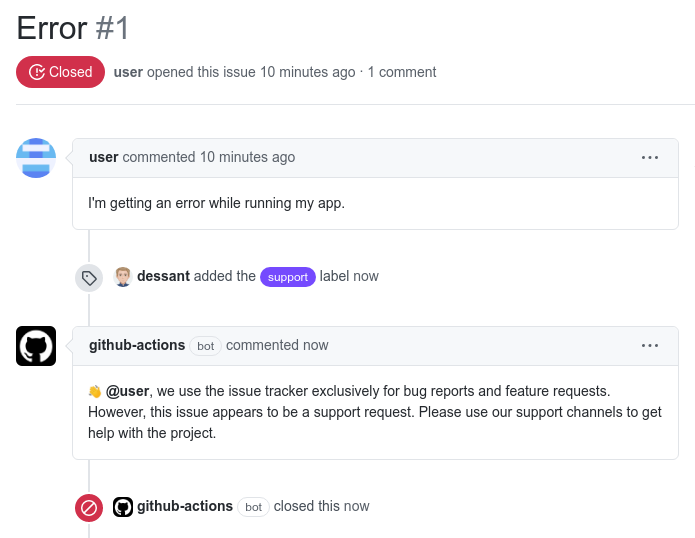

# Support Requests

Support Requests is a GitHub App built with [Probot](https://github.com/probot/probot)
that comments on and closes issues labeled as support requests.



## Supporting the Project

Support Requests is an MIT-licensed open source project. Its ongoing
development is made possible thanks to the support of awesome backers.
If you'd like to join them, please consider contributing with
[Patreon](https://goo.gl/qRhKSW), [PayPal](https://goo.gl/5FnBaw)
or [Bitcoin](https://goo.gl/uJUAaU).

## Usage

1. **[Install the GitHub App](https://github.com/apps/support)**
2. Create `.github/support.yml` based on the following template
3. Start labeling issues as support requests

Create `.github/support.yml` in the default branch to enable the app.
The file can be empty, or it can override any of these default settings:

```yml
# Configuration for support-requests - https://github.com/dessant/support-requests

# Label used to mark issues as support requests
supportLabel: support
# Comment to post on issues marked as support requests. Add a link
# to a support page, or set to `false` to disable
supportComment: >
  👋 We use the issue tracker exclusively for bug reports and feature requests.
  However, this issue appears to be a support request. Please use our
  support channels to get help with the project.
# Whether to close issues marked as support requests
close: true
# Whether to lock issues marked as support requests
lock: false
```

## Deployment

See [docs/deploy.md](docs/deploy.md) if you would like to run your own
instance of this app.

## License

Support Requests is released under the terms of the MIT License.
Please refer to the LICENSE file.
